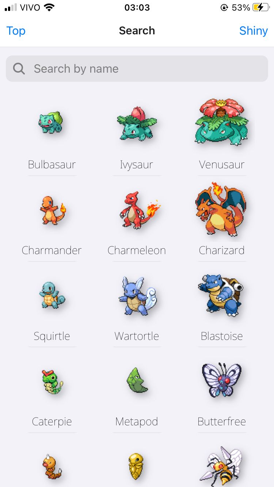

# weakdex
a simple pokedéx for viewing pokémon weaknesses and resistances

 

# running locally
npm install

npx expo start

# credits
[Collapsing Header and bottom tab Animation](https://www.youtube.com/watch?v=nayqNApYp-I)

[React Native: Rotate Image View Using Animation](https://www.youtube.com/watch?v=yKUQGzC8iHM)
